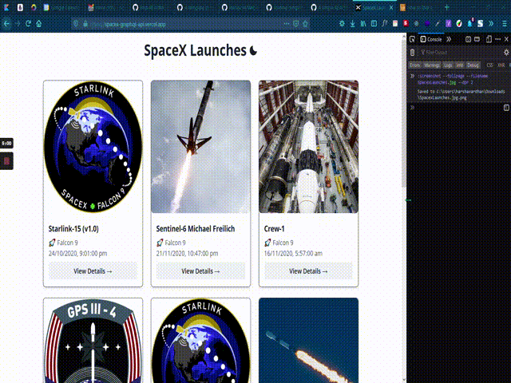

# IQSpaceX
SpaceX Launch Details App
## Description

This is a small web application for displaying the details of SpaceX Launches.

## Features

- Dark and Light Themes

- Responsive Design

- PWA (Progressive Web App)

- Image Lazy Loading

- Component Lazy Loading (Route Splitting)

## Bug Report / Feature Request

If you find a bug (the website couldn't handle the query and / or gave undesired results), kindly open an issue [here](https://github.com/HarshaVardhanNakkina/spacex-graphql-api/issues/new) by including your search query and the expected result.

If you'd like to request a new function, feel free to do so by opening an issue [here](https://github.com/JerryVanZyliq/IQSpaceX/issues/new). Please include sample queries and their corresponding results.

To fix a bug or enhance an existing module, follow these steps:

- Fork the repo
- run `yarn install` or simply `yarn`
- Create a new branch (`git checkout -b improve-feature`)
- Make the appropriate changes in the files
- Commit your changes
- Push to the branch (`git push origin improve-feature`)
- Create a Pull Request

